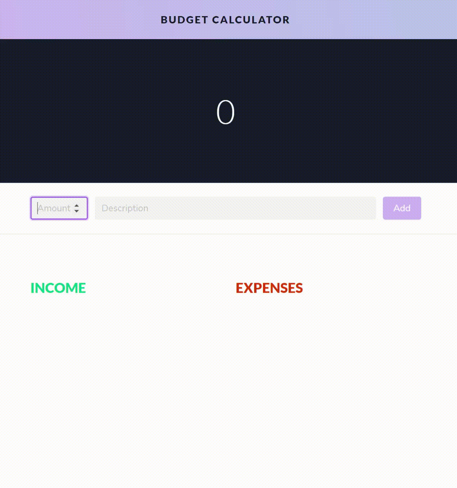
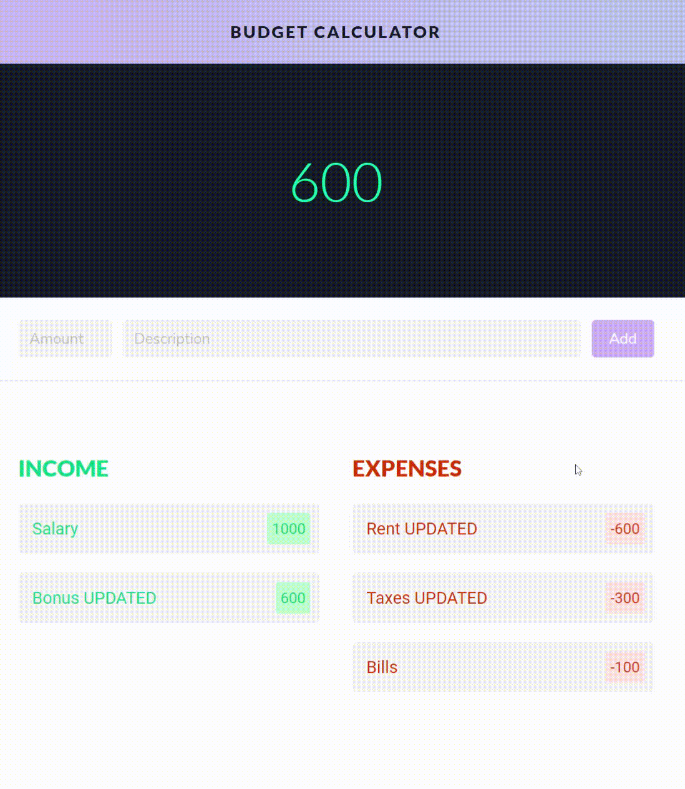
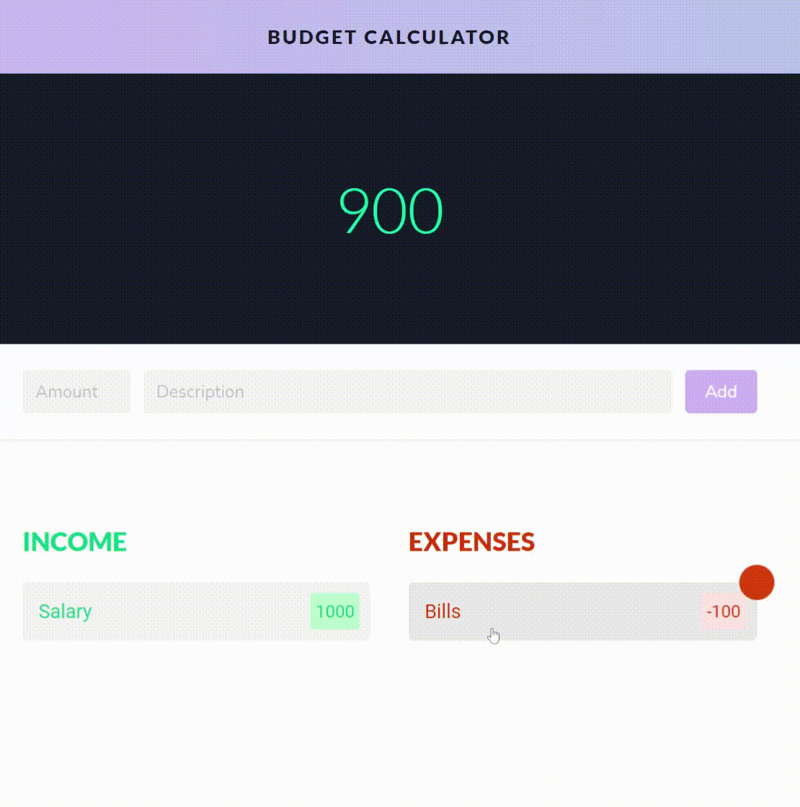

# Not Budget Calculator made with Angular

I stole the project (some says 'forked') from [Mert Ozturk](https://github.com/mrmertozturk) and added the most important missing feature (of all calculators), randomness. Digits of the inputs are randomly changed with any other digit at 50% and everything is calculated accordingly.

## Features

### 1) You can edit entries! Both the amount and the description.

### 2) You can delete entries.

### 3) You can move entries between income and expenses columns.

